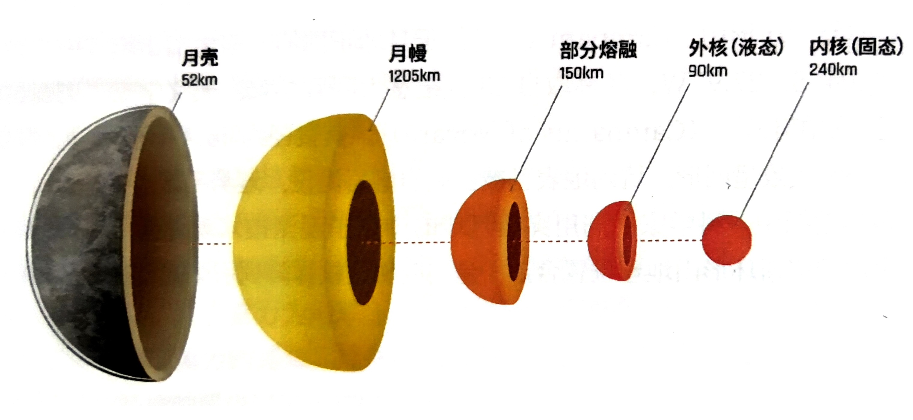

# 月表构造

## 月尘

月球表面覆盖着一层月壤，构成主要是岩石碎屑和尘埃，因其如同尘土粉末一般，俗称月尘。航天员和月球车在月表行动容易造成尘埃飞扬，月尘覆盖在太阳能电池板或者航天器表面很容易引起故障。因此，航天员必须花大量时间来清除。如果月尘带入月球基地，航天员不慎吸入可能会导致类似花粉症般打喷嚏的过敏现象，因此月球基地会提供平衡压舱内的通风过滤系统，或是采用防尘材料的航天服等。

## 环形山

### / 概况

环形山是月表主要的地形特征，形状近似圆形凹坑，绝大部分是由其他天体撞击而形成的，因此又被叫作撞击坑或者陨石坑。环形山一圈为高耸的岩石壁，“逐月”计划中的月球基地和“逐月”卫星发动机均倚山壁而建造，利用壁面提供天然地基。2058 年“月球危机”中，人类选择在坎帕努斯环形山核爆月球。

### / 坎帕努斯环形山

坎帕努斯环形山（\(Campanus\)）是位于月球正面的一座大撞击坑，中心经纬度为 28.04°S,27.9°W，名称取自 13 世纪意大利数学家、天文学家“诺瓦拉的乔凡尼·坎帕努斯”（\(Campanus\) \(of\) \(Novara\)）。其直径约 46.4 千米，深度约 2.3 千米，外观大致呈圆形，坑内地表已被玄武岩熔岩淹没，地势平坦。

多年勘探中，科学家们利用穿透月球的中微子观测技术观测到了月幔结构,

曾提出坎帕努斯环形山地理位置合适，是实施相控核弹阵列引爆月球的最佳场所。

## 氦-3

氦-3 是一种在“太阳危机”时期人类主要使用的能源之一。月球土壤中蕴含大量的氦-3（详见第 361 页），月球基地的一个主要功能就是进行氦-3 的开采、液化和运输。各国自动化挖掘中，航天员们常常有“氦-3 挖掘哪家强”的奇怪攀比心理。

## 月表矿石、水资源

“太阳危机”时期，人类通过陆续发射的月球探测器对月球的成分及其含量进行了分析，发现月球上分布着大量的玄武岩，其中钛铁矿体积近四分之一，进而提取钛铁矿中的钛和铁，以生产水和液氧。人类放弃使用月表深坑里发现的水冰，是因为它们往往只存在于永久阴影区，坑内温度低达零下 220℃，机械过于寒冷，无法进行操作。

\({FeTiO_3+H_2\stackrel{燃烧} {=} Fe+TiO_3+H_2O}\)

\({2H_2 + O_2 \stackrel {电解} {=} 2H_2O}\)

## 月球内部构造

“太阳危机”时期，经过人类多年对月勘探，月球内部构造大致如下图所示:

