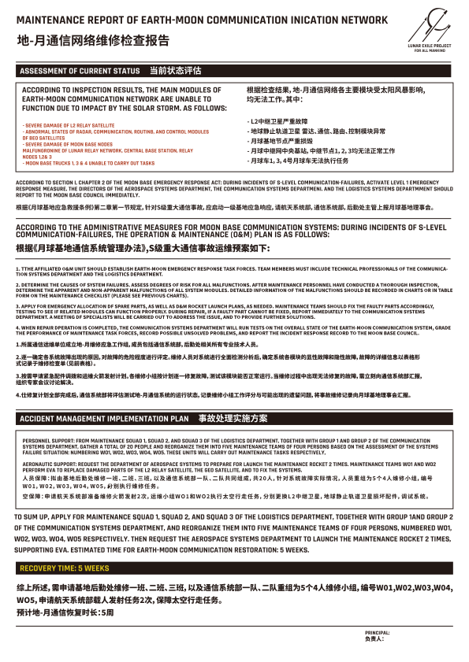

# 太阳风暴

## 概况

太阳风暴是指太阳的剧烈爆发活动以及对周围空间造成的干扰。在太阳风暴爆发时，大量带电粒子会形成高速粒子流，并向外发散，穿过日球层，影响整个太阳系,包括地球及其磁层。
“太阳危机”时期，太阳的异常活动导致太阳风暴成为越发频繁的自然灾害，对地球和月球的灾害影响在范围和程度上都有所增强，比如大范围干扰无人机械设备,影响地球和月球的发动机建设进度。其中 2044 年发生的超强太阳风暴，强度达到 1859 年“卡林顿事件”（Carrington Event）的数十倍以上，对人类社会产生了深远的影响。同时，长期过量辐射也会导致人体免疫力的下降，“辐射癌”成为人类健康“头号杀手”。

## 级别

太阳风暴的级别衡量有多种方式，其中主要衡量太阳耀斑（即太阳内部活动剧烈程度）的通常分为 A、B、C、M、X 和 Z 级别，每级别划分成十个等级。乙级耀斑在一般情况下鲜有发生，然而在“太阳危机”时期成为一种频繁的自然灾害。另一些主要衡量对地球本身造成的影响，如衡量地磁暴的 G 级别分类（Geomagnetic Storms），衡量辐射伤害的 S 级别分类（Solar Radiation Storms），衡量对通信和导航影响的 R 级别分类（Radio Blackouts）等。
“太阳危机”时期，曾经的衡量标准不再适用于过度活跃的太阳活动，因此科学家们经过重新评估后，将地磁暴的级别统一划分为 G1 至 G7 级，G7 为最高。

G1：超微级，平均一个太阳周期发生两千九百次。对人类社会影响微弱，极光仅在高纬度地区可见。

G2：微级，平均一个太阳周期发生一千六百次。对高纬度电力系统有一些影响，无人设备可能需要信号辅助，无线通信信号减弱，中高纬度地区可见极光。

G3：有感级，平均一个太阳周期发生六百次。大致表现为电力系统可能需要一定电压校正装置辅助，两千千米以下近地轨道卫星需要手动校正重回轨道，无线通信和卫星导航间歇性失灵，中高纬度地区可见极光等。

G4：中强级，平均一个太阳周期发生三百次。大致表现为范围内电力系统故障,电力保护系统将隔离发生故障的组件来维持电力系统稳定，通信、导航系统数小时紊乱，地表电流增强，中纬度地区可见极光等。

G5：强级，平均一个太阳周期发生二十次。大致表现为电力系统受损，导致区域性停电，通信、导航受阻，低纬度卫星下降严重，地表电流强至可能烧毁电线,中纬度地区可见极光等。

G6：超强级，平均一个太阳周期发生四次。大致表现为电网损坏，变压器被摧毁，大面积电力系统中断，电子设备、卫星系统、通信系统失灵；地球磁场扰动,地表电流暴增，无人设备损坏，同时烧焦的电线对人生命造成威胁；辐射导致暴露的皮肤出现红斑；中低纬度地区可见极光等。

G7：极强级，一个太阳周期一般不会发生。大致表现为电网损坏，变压器被摧毁，城市范围的电力系统中断、电子设备失灵，严重时变电站爆炸；地球磁场剧烈扰动，卫星失控，无线通信中断；强大的辐射导致暴露的皮肤灼伤，对人体伤害较大；低纬度、赤道地区可见极光等。

近未来，太阳风暴活动观测主要依靠空间天气观测预测系统，包括太阳观测卫星和地基天文台等，并通过计算机模型等有限的科技手段来实现太阳活动观测和太阳风暴预警，但尚且无法精准预测其规模和影响。依据天气观测预测系统给出的模型估计，2044 年 10 月之后数年将是太阳活动异常加剧的高峰期，若地球和“逐月”卫星发动机的点火测试不能在此前完成，平均 G6 级别的太阳风暴会给建设周期带来超长延期，极大动摇全球各国对于联合政府“太阳危机”应对计划的信心

## 2044 年超强太阳风暴

### /概况

2044 年超强太阳风暴是 2044 年 10 月发生的一次百年难遇的 G7 级地磁风暴，对波长为 0.1 至 0.8 纳米的软 X 射线的峰值通量检测最终结果（即太阳耀斑级别）为 Z9。

### /对地球的影响

其强大的高能粒子流向外发散，引发地磁扰动和磁暴，对地球电离层造成影响,破坏臭氧层，地球周围运行的卫星发生故障或失控，造成大面积通讯衰弱或中断。破坏电网，重创电力系统，引发全球范围内的电子信号收发塔损毁、变电站爆炸,爆炸引起的火灾和建筑物损毁严重干扰人类社会运作。其也对全球核电站形成强力威胁，造成部分老旧裂变核电站控制系统异常，发生核泄漏事故。这天，由于磁暴的作用，赤道区域的人们夜间也能在近地表看到强烈的紫色极光现象。
“太阳危机”时期，长期暴露于紫外线辐射导致那个时期的人们容易产生痣和小雀斑，严重时紫外线照射的急性效应还会导致皮肤晒伤。2044 年超强太阳风暴期间，强大的辐射导致暴露在户外的民众皮肤灼伤，并造成部分心脏起搏器无法正常工作，危及生命。

### /对月球的影响

#### /概况

由于月球表面没有磁场，太阳风暴粒子直接轰击月表，巨大的等离子体团就如同喷沙机一样击打着月表。同时，高能粒子撞击在月球表面，在月球极地永久阴影区产生“闪电”现象，形成小火花，不过尺度较小，仅约毫米量级。

月球上存在产生极光的条件，只不过一般情况下，月球极光的光强比较低,观测有困难。2044 年超强太阳风暴期间，月表产生了罕见的物理性风暴。

“太阳危机”期间，考虑到极端太空天气影响，联合政府月球基地和月球车均使用注水铅板防护，当太阳风暴强度过于猛烈时，航天员们可进入基地的地下掩体抵挡外来灾害。这是因为暴露在太阳风暴中，会给航天员带来严重的健康问题。对于需要在月表作业的航天员们来讲，过量的辐射会影响到身体健康，严重时甚至会危及性命。2044 年超强太阳风暴中的高能粒子还损坏了航天服的维生系统导致氧气提供和二氧化碳消除不畅，从而进一步威胁航天员们的生命安全。

同时，该起灾害导致了月球通讯系统的衰弱和中断，重创了月球电力系统引起部分变压器爆炸，损毁了用于“逐月”卫星发动机建设的智能量子计算机 550C 硬件设备，这对该计划的实施带来巨大的负面影响。

#### // 通信影响

通信方面，根据检查结果，地月通信网络各主要模块受太阳风暴影响，均无法工作。其中 L2 中继卫星严重故障，地球静止轨道卫星雷达、通信、路由、控制模块异常，月球基地节点严重损毁，月球中继网中央基站和中继节点一、二、三均无法正常工作，月球车一、三、四号无法执行任务。

根据《月球基地应急救援条例》第二章第一节规定，针对 S 级重大通信事故,应启动一级基地应急响应，航天系统部、通信系统部、后勤处主管上报月球基地理事会。
事故处理实施方案如下。

- 人员保障：拟由基地后勤处维修一班、二班、三班，以及通信系统部一队、二队共同组成，共二十人，针对系统故障实际情况，人员重组为五个四人运维小组,编号 W01、W02、W03、WO4、WO5，分别执行维修任务。

- 航空保障：申请航天系统部准备维修火箭发射两次，运维小组 W01 和 W02 执行太空行走任务，分别更换 L2 中继卫星、地球静止轨道卫星损坏配件，调试系统。

根据详细维修计划，预计地月通信恢复时长为五周，这给“逐月”计划带来了巨大的压力。

> **2044 年超强太阳风暴月球基地通信方面详细维修计划（节选）**
